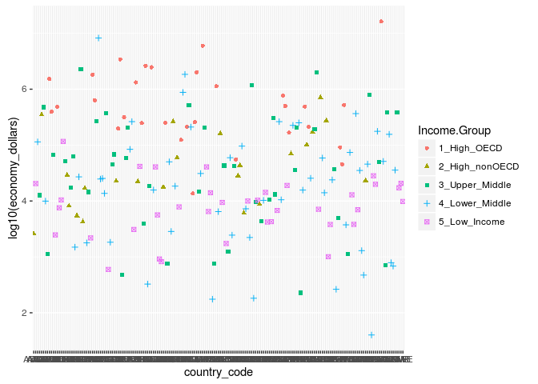
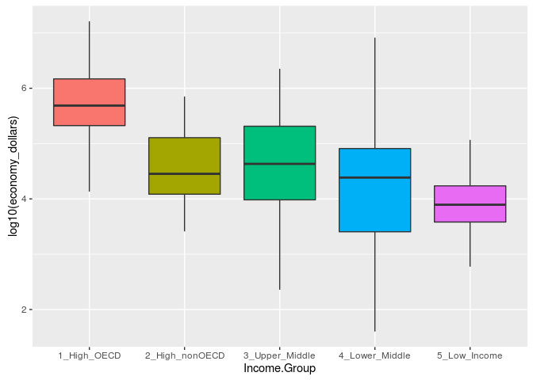
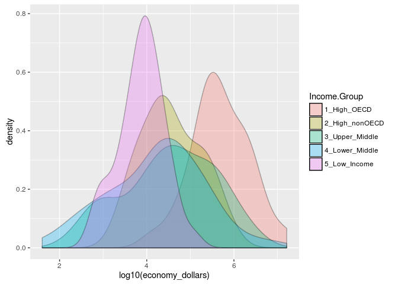
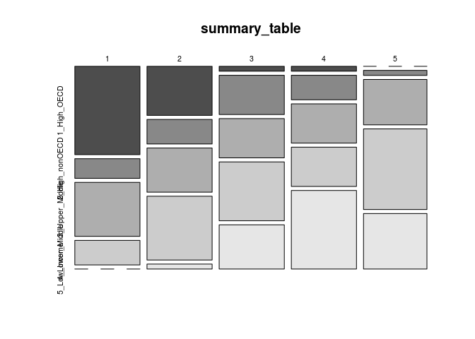

    # ...   load the saved data frame ...
    load("../data/gdp_edu.Rda")

Analysis Requested
------------------

### 1 : Merge the data based on the country shortcode. How many of the IDs match?

#### Number of countries with matched records between the GDP and Educational data sets : 189

### 2 : Sort the data frame in ascending order by GDP (so United States is last). What is the 13th country in the resulting data frame?

    sort_gdp_edu <- gdp_edu[order(gdp_edu$economy_dollars),] 

    head(sort_gdp_edu[,1:4], 13)

    ##     country_code rank                   country_name economy_dollars
    ## 173          TUV  190                         Tuvalu              40
    ## 92           KIR  189                       Kiribati             175
    ## 113          MHL  188               Marshall Islands             182
    ## 137          PLW  187                          Palau             228
    ## 155          STP  186    S\xe3o Tom\xe9 and Principe             263
    ## 59           FSM  185          Micronesia, Fed. Sts.             326
    ## 169          TON  184                          Tonga             472
    ## 46           DMA  183                       Dominica             480
    ## 39           COM  182                        Comoros             596
    ## 184          WSM  181                          Samoa             684
    ## 180          VCT  180 St. Vincent and the Grenadines             713
    ## 69           GRD  178                        Grenada             767
    ## 93           KNA  178            St. Kitts and Nevis             767

#### The 13th ranked nation by GDP is : **St. Kitts and Nevis**

### 3 : What are the average GDP rankings for the "High income: OECD" and "High income:

nonOECD" groups?

    high_income_OECD <- gdp_edu[gdp_edu$Income.Group == "1_High_OECD",]

    high_income_nonOECD <- gdp_edu[gdp_edu$Income.Group == "2_High_nonOECD",]

#### The mean ranking for HighIncome:OECD nations is : **32.9666667**

#### The mean ranking for HighIncome:nonOECD nations is : **91.9130435**

### **Distributional plots**

### 4 Show the distribution of GDP value for all the countries and color plots by income group.

    ggplot(gdp_edu, aes(x = country_code, y = log10(economy_dollars), shape = Income.Group, color = Income.Group )) + geom_point()

    ggplot(gdp_edu, aes(x = Income.Group, y = log10(economy_dollars), fill = Income.Group)) + geom_boxplot() +
        guides(fill=FALSE)

    ggplot(gdp_edu, aes(x = log10(economy_dollars), fill =  Income.Group)) + geom_density(alpha=.3)

**... Summary Statistics**
--------------------------

### 5 Provide summary statistics of GDP by income groups.

    library('dplyr')

    gdp_edu_table <- gdp_edu %>% group_by(Income.Group) %>% summarize(
                    n_nation = length(Income.Group),
                    min_gdp = min(economy_dollars),
                    qtr_01 = quantile(economy_dollars)[[2]],
                    mean_gdp = mean(economy_dollars),
                    qtr_03 = quantile(economy_dollars)[[4]],
                    max_gdp = max(economy_dollars),
                    stdev = sd(economy_dollars))
                    
    sort_gdp_edu_table <- gdp_edu_table[order(gdp_edu_table$mean_gdp),] 

    #### Summary statistics for the 5 income groups are shown in following table.  
    #The summary statistics include :  
    #- Number of countries in each group  
    #- Minimum GDP in each group (Millions $ US)  
    #- 25th percentile GDP  
    #- Mean GDP  
    #- 75th percentile GDP  
    #- Maximum GDP in the group  

    sort_gdp_edu_table

    ## # A tibble: 5 × 8
    ##     Income.Group n_nation min_gdp    qtr_01   mean_gdp    qtr_03  max_gdp
    ##            <chr>    <int>   <dbl>     <dbl>      <dbl>     <dbl>    <dbl>
    ## 1   5_Low_Income       37     596   3814.00   14410.78   17204.0   116355
    ## 2 2_High_nonOECD       23    2584  12838.00  104349.83  131204.5   711050
    ## 3 3_Upper_Middle       45     228   9613.00  231847.84  205789.0  2252664
    ## 4 4_Lower_Middle       54      40   2548.75  256663.48   81448.0  8227103
    ## 5    1_High_OECD       30   13579 211146.75 1483917.13 1480047.2 16244600
    ## # ... with 1 more variables: stdev <dbl>

=-=-=-=-=-=-=-=-=-=-=-=-=-=-=-=-=-=-=-=-=-=-=-=-=-=-=-=-=-=-=-=-=-=-=-=-=-=-=-  
**Quartile Summary**  
-=-=-=-=-=-=-=-=-=-=-=-=-=-=-=-=-=-=-=-=-=-=-=-=-=-=-=-=-=-=-=-=-=-=-=-=-=-=-=-  
\#\#\# 6 Cut the GDP ranking into 5 separate quantile groups.  
Make a table versus Income.Group.

    # ...   to identify the quintile gdp ranking ... create new data frame, sorted by rank
    sort_gdp_edu_by_rank <- gdp_edu[order(gdp_edu$rank),] 

    # ...   count the number of ranks in the data set
    n_ranks <- dim(gdp_edu)[1]

    # ...   assign ranked order quintile (1..5) to each data row
    quint <- c(0 : (n_ranks-1))
    quint <- as.integer(quint/(n_ranks/5) ) + 1

    # ...   bind the quintile group as additional column in data frame
    sort_gdp_edu_by_rank <- cbind (sort_gdp_edu_by_rank, quint)

    high_rank_lower_middle_income <- sort_gdp_edu_by_rank[
                                            sort_gdp_edu_by_rank$Income.Group == "4_Lower_Middle"
                                            & quint == 1,]

#### The list of countries which are Lower middle income but among the 38 nations with highest GDP are :

    print(sprintf(" N  : Rank  |            Country Name        | GDP (US$M)"))

    ## [1] " N  : Rank  |            Country Name        | GDP (US$M)"

    for (indx in 1 : dim(high_rank_lower_middle_income)[1])
    {
        print(sprintf("%2d : %5d | %30s | %8d", indx,
                      high_rank_lower_middle_income$rank[indx],
                      high_rank_lower_middle_income$Long.Name[indx],
                      high_rank_lower_middle_income$economy_dollars[indx]))
    }

    ## [1] " 1 :     2 |     People's Republic of China |  8227103"
    ## [1] " 2 :    10 |              Republic of India |  1841710"
    ## [1] " 3 :    16 |          Republic of Indonesia |   878043"
    ## [1] " 4 :    31 |            Kingdom of Thailand |   365966"
    ## [1] " 5 :    38 |         Arab Republic of Egypt |   262832"

#### The following figures provide some visualizations of the distribution of countries, depicting the relationship between the quintiles of GDP distribition to income levels as identified from the World Bank Educational data sets. There is, as has been demonstrated above, a strong association between national GDP and per capita income level groupings.

    # ...   shorten the data frame name, for convenience
    sgebr <- sort_gdp_edu_by_rank

    # ...   create summary table of quintile, income groups
    summary_table <- table(sgebr$quint, sgebr$Income.Group)
    summary_table

    ##    
    ##     1_High_OECD 2_High_nonOECD 3_Upper_Middle 4_Lower_Middle 5_Low_Income
    ##   1          18              4             11              5            0
    ##   2          10              5              9             13            1
    ##   3           1              8              8             12            9
    ##   4           1              5              8              8           16
    ##   5           0              1              9             16           11

    # ...   make some plots to visualize the data by quintile groups

    barplot(summary_table,legend = T, beside = T, main = 'income by quintile')

    mosaicplot(summary_table, color = TRUE)

