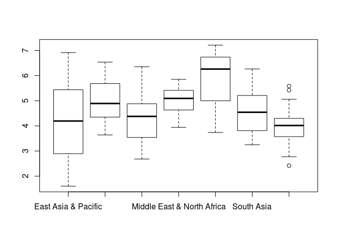

    library(repmis)
    library(RCurl)
    library(methods)
    library(ggplot2)
    library(pastecs)

    require (reshape2)
    require (xtable)
    require (ascii)

    ## R Markdown

    # ...   -=-=-=-=-=-=-=-=-=-=-=-=-=-=-=-=-=-=-=-=-=-=-=-=-=-=-=-=-=-=-=-=-=-=-=-=-
    # ...       - some data sets
    # ...   -=-=-=-=-=-=-=-=-=-=-=-=-=-=-=-=-=-=-=-=-=-=-=-=-=-=-=-=-=-=-=-=-=-=-=-=-

    # ...   gdp data
    #           https://d396qusza40orc.cloudfront.net/getdata%2Fdata%2FGDP.csv
    #

    #,Gross domestic product 2012,,,,,,,,
    #,,,,,,,,,
    #,,,,(millions of,,,,,
    #,Ranking,,Economy,US dollars),,,,,
    #,,,,,,,,,
    #USA,1,,United States," 16,244,600 ",,,,,
    #CHN,2,,China," 8,227,103 ",,,,,
    #JPN,3,,Japan," 5,959,718 ",,,,,
    #DEU,4,,Germany," 3,428,131 ",,,,,

    #           http://data.worldbank.org/data-catalog/GDP-ranking-table

    # ... educational data

    #CountryCode,Long Name,Income Group,Region,Lending category,Other groups,Currency Unit,Latest population census,Latest household survey,Special Notes,National accounts base year,National accounts reference year,System of National Accounts,SNA price valuation,Alternative conversion factor,PPP survey year,Balance of Payments Manual in use,External debt Reporting status,System of trade,Government Accounting concept,IMF data dissemination standard,Source of most recent Income and expenditure data,Vital registration complete,Latest agricultural census,Latest industrial data,Latest trade data,Latest water withdrawal data,2-alpha code,WB-2 code,Table Name,Short Name
    #ABW,Aruba,High income: nonOECD,Latin America & Caribbean,,,Aruban florin,2000,,,1995,,,,,,,,Special,,,,,,,2008,,AW,AW,Aruba,Aruba
    #ADO,Principality of Andorra,High income: nonOECD,Europe & Central Asia,,,Euro,Register based,,,,,,,,,,,General,,,,Yes,,,2006,,AD,AD,Andorra,Andorra
    #AFG,Islamic State of Afghanistan,Low income,South Asia,IDA,HIPC,Afghan afghani,1979,"MICS, 2003",Fiscal year end: March 20; reporting period for national accounts data: FY.,2002/2003,,,VAB,,,,Actual,General,Consolidated,GDDS,,,,,2008,2000,AF,AF,Afghanistan,Afghanistan
    #AGO,People's Republic of Angola,Lower middle income,Sub-Saharan Africa,IDA,,Angolan kwanza,1970,"MICS, 2001, MIS, 2006/07",,1997,,,VAP,1991-96,2005,BPM5,Actual,Special,,GDDS,"IHS, 2000",,1964-65,,1991,2000,AO,AO,Angola,Angola

    #       https://d396qusza40orc.cloudfront.net/getdata%2Fdata%2FEDSTATS_Country.csv
    #       http://data.worldbank.org/data-catalog/ed-stats

    # ...   -=-=-=-=-=-=-=-=-=-=-=-=-=-=-=-=-=-=-=-=-=-=-=-=-=-=-=-=-=-=-=-=-=-=-=-=-
    # ...   gdp data in & clean
    # ...   -=-=-=-=-=-=-=-=-=-=-=-=-=-=-=-=-=-=-=-=-=-=-=-=-=-=-=-=-=-=-=-=-=-=-=-=-

    url <- "https://d396qusza40orc.cloudfront.net/getdata%2Fdata%2FGDP.csv"
    download.file(url, destfile = "./GDP.csv")
    gdp <- read.csv("GDP.csv", sep = ",",
                    header = FALSE,
                    skip = 5,
                    stringsAsFactors = FALSE)

    gdp_names <- c("country_code", "rank", "aaa", "country_name", "economy_dollars")
    names(gdp) <- gdp_names

    gdp$rank <- as.integer(gdp$rank)

    ## Warning: NAs introduits lors de la conversion automatique

    gdp <- gdp[!is.na(gdp$rank),]

    gdp$economy_dollars <- gsub(",", "", gdp$economy_dollars)
    gdp$economy_dollars <- as.numeric(gdp$economy_dollars)

    gdp[3] <- NULL
    width <- dim(gdp)[2]
    gdp[5:width] <- NULL

    # ...   -=-=-=-=-=-=-=-=-=-=-=-=-=-=-=-=-=-=-=-=-=-=-=-=-=-=-=-=-=-=-=-=-=-=-=-=-
    # ...   educational data in & clean
    # ...   -=-=-=-=-=-=-=-=-=-=-=-=-=-=-=-=-=-=-=-=-=-=-=-=-=-=-=-=-=-=-=-=-=-=-=-=-

    url <- "https://d396qusza40orc.cloudfront.net/getdata%2Fdata%2FEDSTATS_Country.csv"
    download.file(url, destfile = "./EDSTATS_Country.csv")
    edu <- read.csv("EDSTATS_Country.csv", sep = ",",
                    header = TRUE,
                    skip = 0,
                    stringsAsFactors = FALSE)

    width <- dim(edu)[2]
    edu[5:width] <- NULL

    gdp_edu <- merge(gdp, edu, by.x = "country_code", by.y = "CountryCode")

    gdp_edu[gdp_edu$Income.Group == "High income: OECD",   ]$Income.Group <- "1_High_OECD" 
    gdp_edu[gdp_edu$Income.Group == "High income: nonOECD",]$Income.Group <- "2_High_nonOECD" 
    gdp_edu[gdp_edu$Income.Group == "Upper middle income", ]$Income.Group <- "3_Upper_Middle" 
    gdp_edu[gdp_edu$Income.Group == "Lower middle income", ]$Income.Group <- "4_Lower_Middle" 
    gdp_edu[gdp_edu$Income.Group == "Low income",          ]$Income.Group <- "5_Low_Income" 

    str(gdp_edu)

    ## 'data.frame':    189 obs. of  7 variables:
    ##  $ country_code   : chr  "ABW" "AFG" "AGO" "ALB" ...
    ##  $ rank           : int  161 105 60 125 32 26 133 172 12 27 ...
    ##  $ country_name   : chr  "Aruba" "Afghanistan" "Angola" "Albania" ...
    ##  $ economy_dollars: num  2584 20497 114147 12648 348595 ...
    ##  $ Long.Name      : chr  "Aruba" "Islamic State of Afghanistan" "People's Republic of Angola" "Republic of Albania" ...
    ##  $ Income.Group   : chr  "2_High_nonOECD" "5_Low_Income" "4_Lower_Middle" "3_Upper_Middle" ...
    ##  $ Region         : chr  "Latin America & Caribbean" "South Asia" "Sub-Saharan Africa" "Europe & Central Asia" ...

    summary(gdp_edu)

    ##  country_code            rank        country_name       economy_dollars   
    ##  Length:189         Min.   :  1.00   Length:189         Min.   :      40  
    ##  Class :character   1st Qu.: 48.00   Class :character   1st Qu.:    6972  
    ##  Mode  :character   Median : 95.00   Mode  :character   Median :   28242  
    ##                     Mean   : 95.31                      Mean   :  379597  
    ##                     3rd Qu.:143.00                      3rd Qu.:  205789  
    ##                     Max.   :190.00                      Max.   :16244600  
    ##   Long.Name         Income.Group          Region         
    ##  Length:189         Length:189         Length:189        
    ##  Class :character   Class :character   Class :character  
    ##  Mode  :character   Mode  :character   Mode  :character  
    ##                                                          
    ##                                                          
    ## 

    names(gdp_edu)

    ## [1] "country_code"    "rank"            "country_name"    "economy_dollars"
    ## [5] "Long.Name"       "Income.Group"    "Region"

    dim(gdp_edu)

    ## [1] 189   7

    boxplot(log10(gdp_edu$economy_dollars) ~ gdp_edu$Region)

    save(gdp_edu, file = "gdp_edu.Rda")
