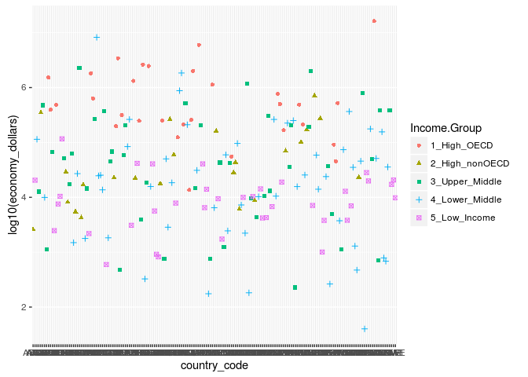
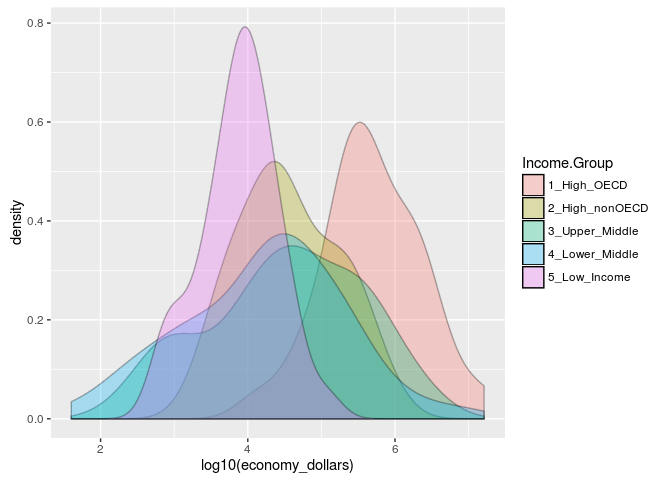
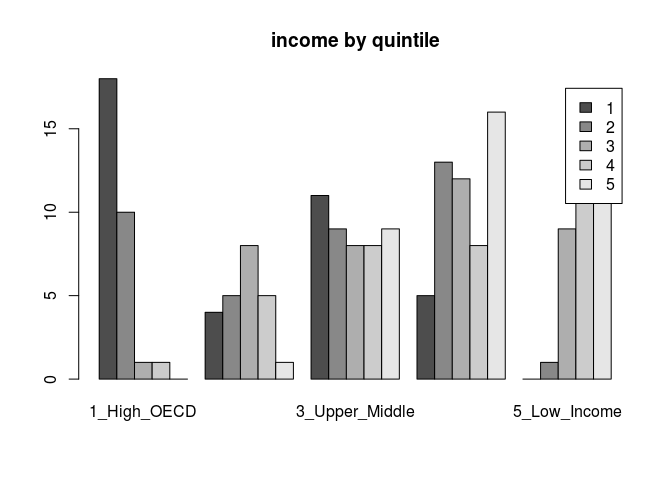

R Markdown
----------

    # ...   -=-=-=-=-=-=-=-=-=-=-=-=-=-=-=-=-=-=-=-=-=-=-=-=-=-=-=-=-=-=-=-=-=-=-=-=-
    # ...       - some data sets
    # ...   -=-=-=-=-=-=-=-=-=-=-=-=-=-=-=-=-=-=-=-=-=-=-=-=-=-=-=-=-=-=-=-=-=-=-=-=-

    # ...   gdp data
    #           https://d396qusza40orc.cloudfront.net/getdata%2Fdata%2FGDP.csv
    #

    #,Gross domestic product 2012,,,,,,,,
    #,,,,,,,,,
    #,,,,(millions of,,,,,
    #,Ranking,,Economy,US dollars),,,,,
    #,,,,,,,,,
    #USA,1,,United States," 16,244,600 ",,,,,
    #CHN,2,,China," 8,227,103 ",,,,,
    #JPN,3,,Japan," 5,959,718 ",,,,,
    #DEU,4,,Germany," 3,428,131 ",,,,,

    #           http://data.worldbank.org/data-catalog/GDP-ranking-table

    # ... educational data

    #CountryCode,Long Name,Income Group,Region,Lending category,Other groups,Currency Unit,Latest population census,Latest household survey,Special Notes,National accounts base year,National accounts reference year,System of National Accounts,SNA price valuation,Alternative conversion factor,PPP survey year,Balance of Payments Manual in use,External debt Reporting status,System of trade,Government Accounting concept,IMF data dissemination standard,Source of most recent Income and expenditure data,Vital registration complete,Latest agricultural census,Latest industrial data,Latest trade data,Latest water withdrawal data,2-alpha code,WB-2 code,Table Name,Short Name
    #ABW,Aruba,High income: nonOECD,Latin America & Caribbean,,,Aruban florin,2000,,,1995,,,,,,,,Special,,,,,,,2008,,AW,AW,Aruba,Aruba
    #ADO,Principality of Andorra,High income: nonOECD,Europe & Central Asia,,,Euro,Register based,,,,,,,,,,,General,,,,Yes,,,2006,,AD,AD,Andorra,Andorra
    #AFG,Islamic State of Afghanistan,Low income,South Asia,IDA,HIPC,Afghan afghani,1979,"MICS, 2003",Fiscal year end: March 20; reporting period for national accounts data: FY.,2002/2003,,,VAB,,,,Actual,General,Consolidated,GDDS,,,,,2008,2000,AF,AF,Afghanistan,Afghanistan
    #AGO,People's Republic of Angola,Lower middle income,Sub-Saharan Africa,IDA,,Angolan kwanza,1970,"MICS, 2001, MIS, 2006/07",,1997,,,VAP,1991-96,2005,BPM5,Actual,Special,,GDDS,"IHS, 2000",,1964-65,,1991,2000,AO,AO,Angola,Angola

    #       https://d396qusza40orc.cloudfront.net/getdata%2Fdata%2FEDSTATS_Country.csv
    #       http://data.worldbank.org/data-catalog/ed-stats

    # ...   -=-=-=-=-=-=-=-=-=-=-=-=-=-=-=-=-=-=-=-=-=-=-=-=-=-=-=-=-=-=-=-=-=-=-=-=-
    # ...   gdp data in & clean
    # ...   -=-=-=-=-=-=-=-=-=-=-=-=-=-=-=-=-=-=-=-=-=-=-=-=-=-=-=-=-=-=-=-=-=-=-=-=-

    url <- "https://d396qusza40orc.cloudfront.net/getdata%2Fdata%2FGDP.csv"
    download.file(url, destfile = "./GDP.csv")
    gdp <- read.csv("GDP.csv", sep = ",",
                    header = FALSE,
                    skip = 5,
                    stringsAsFactors = FALSE)

    gdp_names <- c("country_code", "rank", "aaa", "country_name", "economy_dollars")
    names(gdp) <- gdp_names

    gdp$rank <- as.integer(gdp$rank)

    ## Warning: NAs introduits lors de la conversion automatique

    gdp <- gdp[!is.na(gdp$rank),]

    gdp$economy_dollars <- gsub(",", "", gdp$economy_dollars)
    gdp$economy_dollars <- as.numeric(gdp$economy_dollars)

    gdp[3] <- NULL
    width <- dim(gdp)[2]
    gdp[5:width] <- NULL

    # ...   -=-=-=-=-=-=-=-=-=-=-=-=-=-=-=-=-=-=-=-=-=-=-=-=-=-=-=-=-=-=-=-=-=-=-=-=-
    # ...   educational data in & clean
    # ...   -=-=-=-=-=-=-=-=-=-=-=-=-=-=-=-=-=-=-=-=-=-=-=-=-=-=-=-=-=-=-=-=-=-=-=-=-

    url <- "https://d396qusza40orc.cloudfront.net/getdata%2Fdata%2FEDSTATS_Country.csv"
    download.file(url, destfile = "./EDSTATS_Country.csv")
    edu <- read.csv("EDSTATS_Country.csv", sep = ",",
                    header = TRUE,
                    skip = 0,
                    stringsAsFactors = FALSE)

    width <- dim(edu)[2]
    edu[5:width] <- NULL

    gdp_edu <- merge(gdp, edu, by.x = "country_code", by.y = "CountryCode")

    gdp_edu[gdp_edu$Income.Group == "High income: OECD",   ]$Income.Group <- "1_High_OECD" 
    gdp_edu[gdp_edu$Income.Group == "High income: nonOECD",]$Income.Group <- "2_High_nonOECD" 
    gdp_edu[gdp_edu$Income.Group == "Upper middle income", ]$Income.Group <- "3_Upper_Middle" 
    gdp_edu[gdp_edu$Income.Group == "Lower middle income", ]$Income.Group <- "4_Lower_Middle" 
    gdp_edu[gdp_edu$Income.Group == "Low income",          ]$Income.Group <- "5_Low_Income" 

Data is now gathered, cleaned, merged into one data frame

1 Merge the data based on the country shortcode. How many of the IDs
match? 2 Sort the data frame in ascending order by GDP (so United States
is last). What is the 13th country in the resulting data frame? 3 What
are the average GDP rankings for the "High income: OECD" and "High
income: nonOECD" groups?

    sort_gdp_edu <- gdp_edu[order(gdp_edu$economy_dollars),] 

    high_income_OECD <- gdp_edu[gdp_edu$Income.Group == "High income: OECD",]
    mean_oecd <-mean(high_income_OECD$rank)

    high_income_nonOECD <- gdp_edu[gdp_edu$Income.Group == "High income: nonOECD",]
    mean_nonoecd <-mean(high_income_nonOECD$rank)

=-=-=-=-=-=-=-=-=-=-=-=-=-=-=-=-=-=-=-=-=-=-=-=-=-=-=-=-=-=-=-=-=-=-=-=-=-=-=-  
**Distributional plots**  
-=-=-=-=-=-=-=-=-=-=-=-=-=-=-=-=-=-=-=-=-=-=-=-=-=-=-=-=-=-=-=-=-=-=-=-=-=-=-=-

4 Show the distribution of GDP value for all the countries and color
plots by income group. Use ggplot2 to create your plot.

... -=-=-=-=-=-=-=-=-=-=-=-=-=-=-=-=-=-=-=-=-=-=-=-=-=-=-=-=-=-=-=-=-=-=-=-=-
=============================================================================

... summary statistics
======================

... -=-=-=-=-=-=-=-=-=-=-=-=-=-=-=-=-=-=-=-=-=-=-=-=-=-=-=-=-=-=-=-=-=-=-=-=-
=============================================================================

5 Provide summary statistics of GDP by income groups. 6 Cut the GDP
ranking into 5 separate quantile groups. Make a table versus
Income.Group. How many countries are Lower middle income but among the
38 nations with highest GDP?

    ## # A tibble: 5 × 8
    ##     Income.Group n_pays min_gdp    qtr_01   mean_gdp    qtr_03  max_gdp
    ##            <chr>  <int>   <dbl>     <dbl>      <dbl>     <dbl>    <dbl>
    ## 1   5_Low_Income     37     596   3814.00   14410.78   17204.0   116355
    ## 2 2_High_nonOECD     23    2584  12838.00  104349.83  131204.5   711050
    ## 3 3_Upper_Middle     45     228   9613.00  231847.84  205789.0  2252664
    ## 4 4_Lower_Middle     54      40   2548.75  256663.48   81448.0  8227103
    ## 5    1_High_OECD     30   13579 211146.75 1483917.13 1480047.2 16244600
    ## # ... with 1 more variables: stdev <dbl>

=-=-=-=-=-=-=-=-=-=-=-=-=-=-=-=-=-=-=-=-=-=-=-=-=-=-=-=-=-=-=-=-=-=-=-=-=-=-=-  
**Quartile Summary**  
-=-=-=-=-=-=-=-=-=-=-=-=-=-=-=-=-=-=-=-=-=-=-=-=-=-=-=-=-=-=-=-=-=-=-=-=-=-=-=-

    sort_gdp_edu_by_rank <- gdp_edu[order(gdp_edu$rank),] 

    n_ranks <- dim(gdp_edu)[1]
    quint <- c(0 : (n_ranks-1))
    quint <- as.integer(quint/(n_ranks/5) ) + 1

    sort_gdp_edu_by_rank <- cbind (sort_gdp_edu_by_rank, quint)

    hgh_rank_lower_middle_income <- sort_gdp_edu_by_rank[
                                            sort_gdp_edu_by_rank$Income.Group == "Lower middle income"
                                            & quint == 1,]

    sgebr <- sort_gdp_edu_by_rank

    summary_table <- table(sgebr$quint, sgebr$Income.Group)
    summary_table

    ##    
    ##     1_High_OECD 2_High_nonOECD 3_Upper_Middle 4_Lower_Middle 5_Low_Income
    ##   1          18              4             11              5            0
    ##   2          10              5              9             13            1
    ##   3           1              8              8             12            9
    ##   4           1              5              8              8           16
    ##   5           0              1              9             16           11

    barplot(summary_table,legend = T, beside = T, main = 'income by quintile')

    library(vcd)

    ## Loading required package: grid

    mosaicplot(summary_table, color = TRUE)

