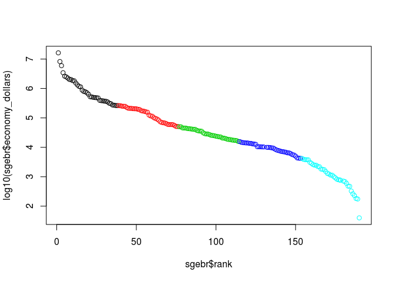

    # ...   load the saved data frame ...
    load("../data/gdp_edu.Rda")

### **Summary Presentation**

This evaluation reviewed the data sets provided by the World Bank for
GPD Rankings and Educational Levels.  
The evaluation conducted identified trends in these two data sets
indicating strong coincidence of national GDP ranking and similar
classification by the educational data sets.

This is understood from the following graphics :

    ggplot(gdp_edu, aes(x = Income.Group, y = log10(economy_dollars), fill = Income.Group)) + geom_boxplot() +
        guides(fill=FALSE)

    # ...   to identify the quintile gdp ranking ... create new data frame, sorted by rank
    sort_gdp_edu_by_rank <- gdp_edu[order(gdp_edu$rank),] 
    n_ranks <- dim(gdp_edu)[1]
    quint <- c(0 : (n_ranks-1))
    quint <- as.integer(quint/(n_ranks/5) ) + 1
    sort_gdp_edu_by_rank <- cbind (sort_gdp_edu_by_rank, quint)
    sgebr <- sort_gdp_edu_by_rank

    plot(log10(sgebr$economy_dollars) ~ sgebr$rank, col = sgebr$quint)

    plot(sgebr$economy_dollars ~ sgebr$rank, col = sgebr$quint)

### The implication from the above figure is that there is a clear separation of the High Income:OECD nations in terms of size of economy (as measured by GDP, in log(US Dollars), in comparison to the remaining income groups. The High Income:nonOECD, Upper Middle, and Lower Middle grouped nations have similar economy sizes (in the range of 1E4.5 millions of US dollars. The Low Income group remains separated from the remaining groups with economy sizes in the range of &lt; 1E4 millions of US dollars.

The line plot, showing the income sizes in sorted order (log $) shows
the separation on log scale, useful for statistical difference
evaluations. However, the line plot showing the income sizes in sorted
order (actual $ scale, millions) shows in real terms the very real, and
significant differences in nations' economies, with USA and China
clearly separated from the rest of the world economies.
